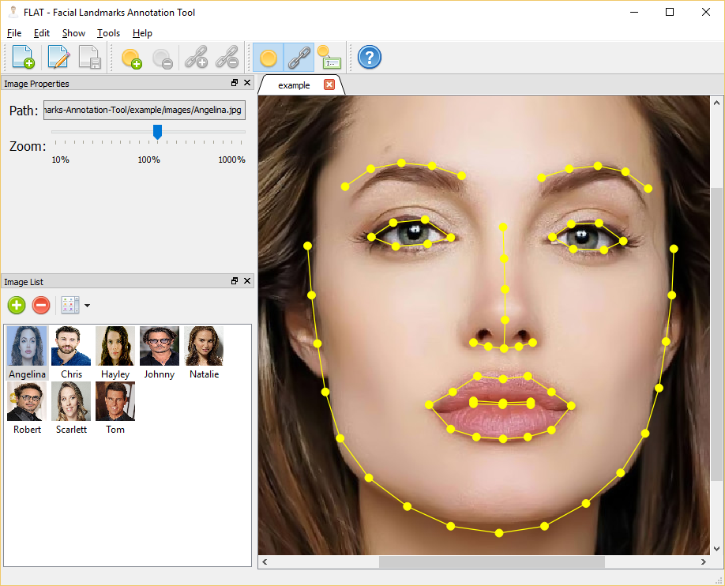

# FLAT - Facial Landmarks Annotation Tool

A visual editor for manually annotating facial landmarks in images of human faces.

## Dependences

The application has been developed and tested with:

- CMake 3.5.0-rc3
- Qt 5.5.1 32-bit

## Building

1. Use CMake to configure and generate the environment. I suggest using the folder `build`, since it is the one ignored by gitignore.
2. In Windows, open the Visual Studio solution and build with the desired build type (*debug*, *release*, etc).
3. In Linux, use type `make` to let the Makefile produce the binary in the build type configured by CMake.
4. The code produces only a single executable named `flat(.exe)`, that depends on Qt and OpenCV dynamic libraries. It also depends on the Face Analysis SDK libraries.

## Credits

Copyright (C) 2016 [Luiz Carlos Vieira](http://www.luiz.vieira.nom.br). Available under GPL (see details in the license file).

The application icons and images are either from or based on the Oxygen Icons Set, downloaded as [PNGs from Felipe Azevedo (pasnox)](https://github.com/pasnox/oxygen-icons-png) and [licensed under LGPL from KDE](https://techbase.kde.org/Projects/Oxygen/Licensing), and the [Farm-Fresh Web Icons Set](http://www.fatcow.com/free-icons), licensed under [Creative Commons (CC BY 4.0)](http://creativecommons.org/licenses/by/4.0/).